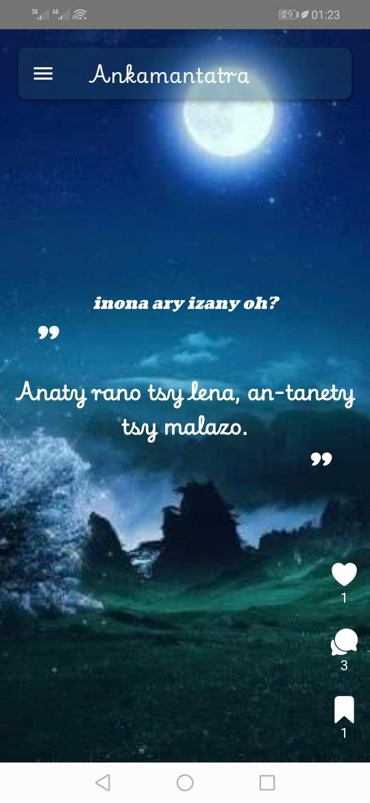

## Ankamantatra
- NB ANG: "Ankamantatra" is a Malagasy culture, a game played by children every day before going to bed at night. And nowadays, this way is slowly fading due to the evolution of technology. And the App helps the Malagasy to remember their culture.

lalao fametrahana fanontaniana, ary maminavina ny valiny amin'ny alalan'ny famantarana ao anaty fanontaniaina.
## Fitsipika: 
- Mifandimbidimby ny mametrahana fanontaniana.
- Miandry ny rehetra afapo vao omena ny valiny.
- afaka mamaetraka ankamantatra rehefa voavaly ny teo aloha.
## Run dev
```bash
    ng serve
```
## Generate icon & splash-screen
```bash
    npx cordova-res
    npx cordova-res android --skip-config --copy
```
## Build web
```bash
    ng build
```
## Build android
```bash
    ionic capacitor sync
    cd android
    ./gradlew assembleDebug
```
## The App:
- web: [ankamantatra.netlify.app](ankamantatra.netlify.app)
- mobile: [ankamantatra.apk](./ankamantatra.apk)
## Preview
